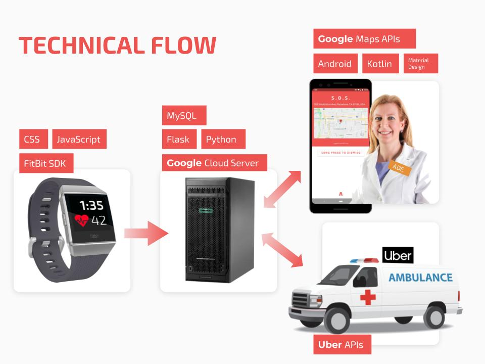

# Auxilium

*These rides we request so that others may live.*

Auxilium is a health emergency alert and help request system. It detects patients’ fatal cardiac failure, contacts the nearest registered AED coordinator and requests the nearest transportation available for a hospital nearby.

## Inspiration

In recent years, news about the death of cardiac arrest has emerged one after another. According to AHA, there are more than 356,000 out-of-hospital cardiac arrests annually in the U.S. The loss of many fresh lives is due to the lack of timely assistance. If professional ambulance personnel can provide first-aid measures for cardiac resuscitation in patients during gold rescue time, this will save tens of thousands of lives.

While the emergence of rideshare platform as Uber might provide new approaches for ambulance and first aid dispatching, we combine hardwares and softwares to develop a system which aims to help patients get timely aid.

## What it does

Auxilium is a health emergency alert and help request system. It detects patients’ fatal cardiac failure, contacts the nearest registered AED coordinator and requests the nearest transportation available for a hospital nearby.

The widely prevalence of wearable devices promise the potential of new ways of emergency report mechanism. Programmed wearable devices send help requests to corresponding professionals when the devices detect fatal health condition. Our system focuses on cardiac arrest and arrhythmia problem. Once the system detects the abnormal, it sends alert to the nearest AED coordinator and request transportation for hospital through Uber.

Our ideal case is Uber has a special product choice for commercial ambulance drivers registered on Uber, but due to the limitation of technology we have, we could only implement the prototype with requesting a normal UberX ride. Since the new ambulance driver could be regarded as new product of Uber like UberX, it requires only tiny modifications to Uber but make significant improvements to the current emergency medical assistance system.

## How we built it

We built a central server deployed on Google Cloud that receives alerts from patients and requests nearest AED coordinators and ambulances for them. The patients’ end, a FitBit app tracking user’s health data (e.g., heart rate), is developed with FitBit SDK in JavaScript for reporting an emergency when heart rate is below a specific value. Each reported emergency contains its location. When the server takes an emergency report, it assigns the emergency to the nearest AED coordinator with an alert message. Meanwhile, the system requests a ride from Uber, ideally it should be an ambulance. The server removes the emergency once the AED coordinator reports it as solved. On the AED coordinator end, an Android client keeps polling for emergencies. When nearby patients are in need, the app makes sound alarm and shows a map view as a Google Maps shortcut for navigation. The AED coordinator needs to long press the dismiss button to stop an alarm in case it is touched inadvertently.

## Challenges we ran into

FitBit watch is required for monitoring patients’ heart, detecting fatal attacks and request alerts to center server. With heart-rate API in FitBit SDK, it is available to obtain real-time heart-rate of patients and then to detect heart-rate attacks. Messaging API is used to send alerts including information of location detected by geolocation API. We finally built an app on FitBit watch with the two APIs for implementation.

The alert system requires a centralized server to manage all the data related to AED coordinator, patient accident location and Uber ride requests. Maintaining connections between AED coordinators personal device with server is a wasting of resources. Instead, we apply a solution similar to most instant message applications. The AED coordinator end app keeps polling server to figure out if a patient is assigned to him/her. We developed a mobile application designates to provide support for these actions.

Once the server received an incidence report, it searches for the nearest AED coordinator and location of hospital. It send to request a Uber ride, we used the Uber developer API. Our server figures out the start and end points for a ride according patient and hospital location and perform the request. The system is still making request using Uber personal account, but for deployment purpose, using a Uber Central account is more reasonable.

## Accomplishments that we are proud of

Our system is able to timely inform the nearest AED coordinator of patient's position and request an uber ambulance to assist patient to be sent to hospital as soon as possible, which will greatly improve the survival rate of these patients.

## What we learned

First of all, we understand how to identify a problem from our life and how solve the problem with the rapid development of technology.

During the development process, we met various problems like server set up issue and API compatibility issues. In the process of solving the problems, we improved our skills in managing all technical skills, and gained a profound understanding of the tools we have.

Last but not least, the project is finished as a team and we improved our teamwork skill which is essential in our future life.

## What's next for Auxilium

The current nearest help allocation mechanism is a comparison between geographic distances. It is not a close reflection of the time needed for the help gets to the patient. Proposing a more accurate and faster method is required.

Meanwhile, current AED coordinator locations are static in database when they registered. It is based on the assumption that AED coordinator in company or school has responsibility to be available during the facility operating time. However, making their locations updates dynamically is a better choice for the functionality of the system. Since each device could access the GPS information, we could achieve this improvement when AED coordinator’s devices polling the server.

In addition, since we could not modify data Uber has, we could only request a normal Uber ride. In this prototype, we request a UberX car. However, we prefer to have a pool of commercial ambulances and once there is a request for help, the rideshare platform only sends the request to nearest registered ambulance. These changes could significantly reduce the time consumed during the scheduling of current ambulance request mechanism and make better use of the ambulance resource scattered in the area. Since the ambulances could be regarded as new product of Uber with a new product ID, it should not require large modification for the current infrastructure of Uber.

We believe with all these future development, Auxilium will finally fulfill its destiny to save more lives.

## Built with
- Python
- Flask
- MySQL
- JavaScript
- CSS
- Fitbit
- Kotlin
- Android
- PHP
- Google Cloud
- Google Maps
- Uber APIs
